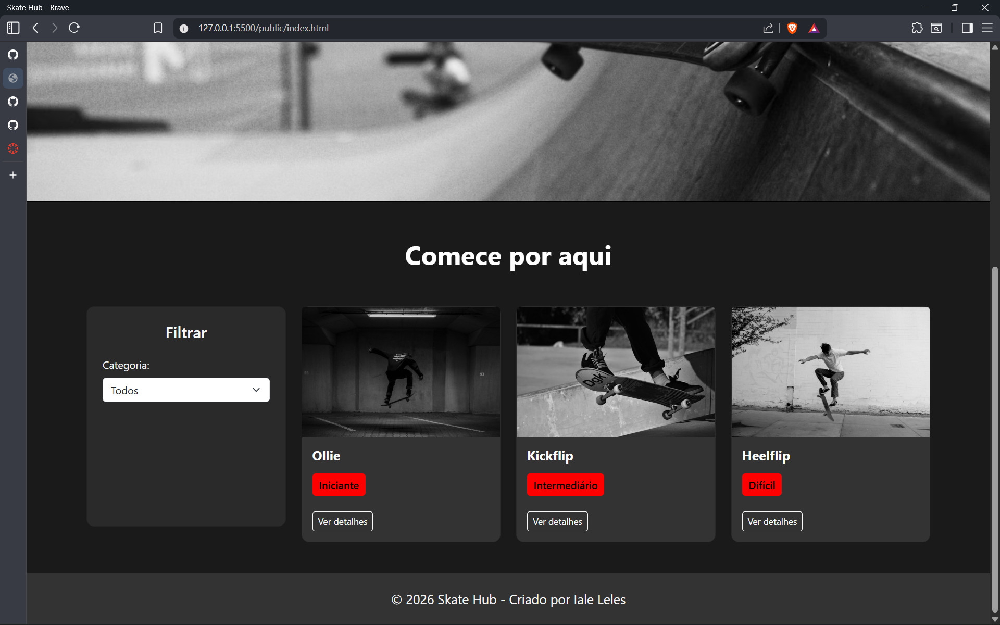
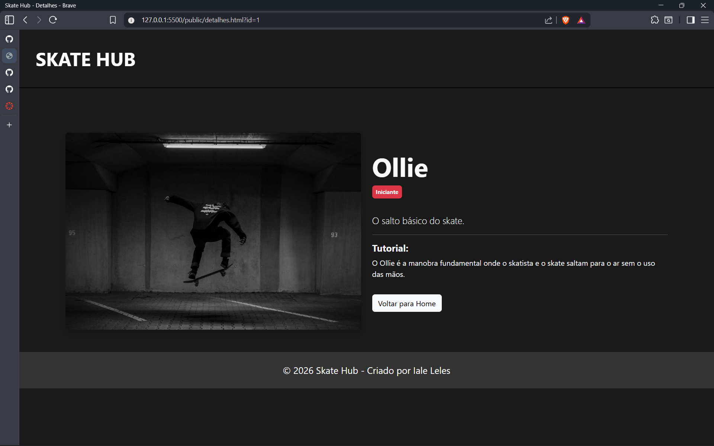

# Trabalho Prático - Semana 11

Nessa etapa, vamos evoluir o trabalho anterior, acrescentando a página de detalhes, conforme o  projeto escolhido. Imagine que a página principal (home-page) mostre um visão dos vários itens que existem no seu site. Ao clicar em um item, você é direcionado pra a página de detalhes. A página de detalhe vai mostrar todas as informações sobre o item do seu projeto. seja esse item uma notícia, filme, receita, lugar turístico ou evento.

Vamos dar um exemplo, se você escolheu o Portal de notícias locais, então sua página principal (home-page) mostra todas as notícias. Ao clicar no titulo ou na imagem de uma notícia específica, você é direcionado para a página de detalhes que trará o texto completo da notícia, o autor e outros detalhes adicionais sobre aquela notícia. O mesmo vai acontecer para todos os demais tipos de projetos. 

## Informações Gerais

- Nome: Iale Leles de Almeida
- Matricula: 927707
- Proposta de projeto escolhida: Skate Hub - Site para encontrar manobras de acordo com o nível de dificuldade.
- Breve descrição sobre seu projeto: O projeto Skate Hub é um site para fãs de skate que querem aprender manobras de acordo com o seu nível de habilidade. Além disso, o site conta com o filtro de acordo com o nível de dificuldade das manobras, para facilitar os usuários.

## Print da home-page com a opção detalhes (*)

## Print da tela de detalhes (*)
